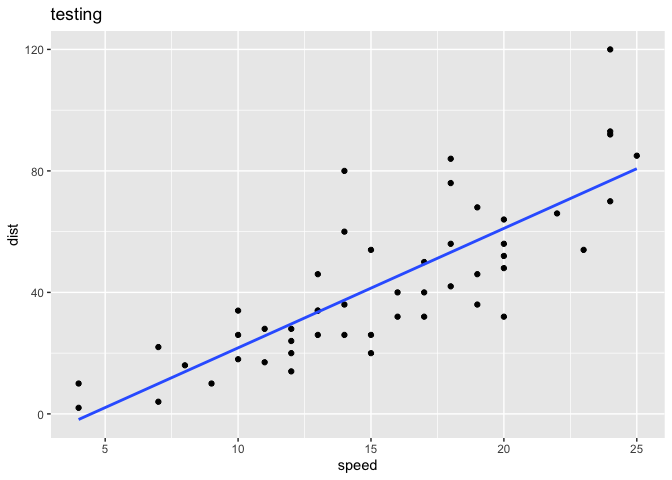
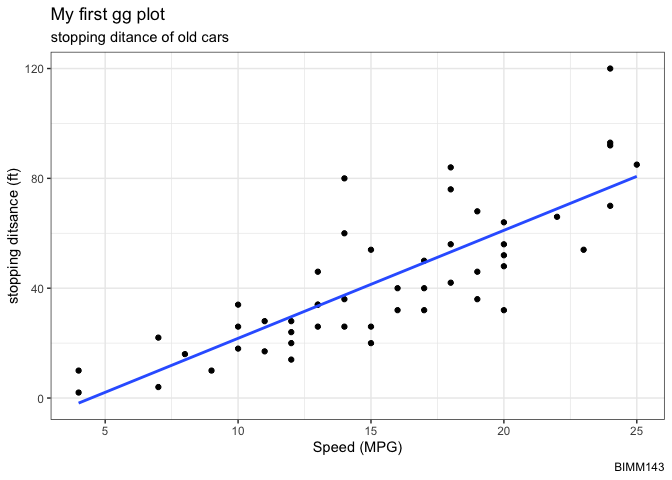
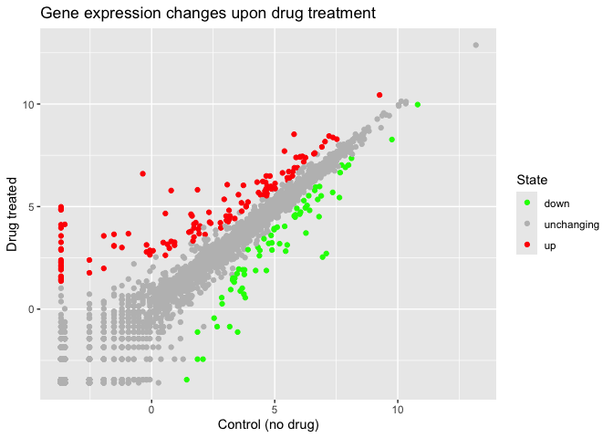
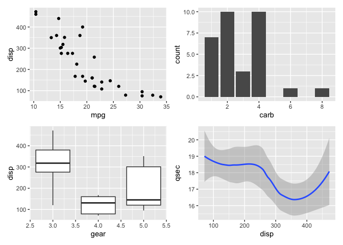
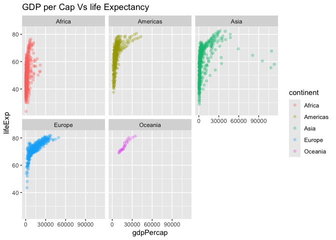

# class05
Tin Nguyen (PID:A15334147)

- [Quarto](#quarto)
- [Running Code](#running-code)
- [Custom color plot](#custom-color-plot)
- [Using different geoms](#using-different-geoms)

## Quarto

Quarto enables you to weave together content and executable code into a
finished document. To learn more about Quarto see <https://quarto.org>.

## Running Code

When you click the **Render** button a document will be generated that
includes both content and the output of embedded code. You can embed
code like this:

``` r
#install.packages("ggplot2")
```

``` r
library(ggplot2)
ggplot(cars)
```


``` r
ggplot(cars) +
  aes(x=speed, y=dist) +
  geom_point()
```


> Q. add a line to show the relationship of speed to stopping distance
> (i.e. add another “layer”)

``` r
p <- ggplot(cars) +
  aes(x=speed, y=dist) +
  geom_point() +
  geom_smooth(se=FALSE, method="lm")
```

> Q. Add a title and subtitle for the plot

``` r
ggplot(cars) +
  aes(x=speed, y=dist) +
  geom_point()
```


> Q. add a line to show the relationship of speed to stopping distance
> (i.e. add another “layer”)

I can always save anyggplot object (i.e. plot) and then use it later for
adding more layers.

``` r
p + ggtitle("testing")
```

    `geom_smooth()` using formula = 'y ~ x'



``` r
p + labs(title = "My first gg plot", subtitle = "stopping ditance of old cars", caption = "BIMM143", x = "Speed (MPG)", y = "stopping ditsance (ft)") +
  theme_bw()
```

    `geom_smooth()` using formula = 'y ~ x'



``` r
url <- "https://bioboot.github.io/bimm143_S20/class-material/up_down_expression.txt"
genes <- read.delim(url)
head(genes)
```

            Gene Condition1 Condition2      State
    1      A4GNT -3.6808610 -3.4401355 unchanging
    2       AAAS  4.5479580  4.3864126 unchanging
    3      AASDH  3.7190695  3.4787276 unchanging
    4       AATF  5.0784720  5.0151916 unchanging
    5       AATK  0.4711421  0.5598642 unchanging
    6 AB015752.4 -3.6808610 -3.5921390 unchanging

> Q. How many columns are there?

``` r
ncol(genes)
```

    [1] 4

> Q. what re the coluumn names?

``` r
colnames(genes)
```

    [1] "Gene"       "Condition1" "Condition2" "State"     

> Q. How many “up” and “down” regulated genees are there?

``` r
#genes$State

head(table(genes$State))
```


          down unchanging         up 
            72       4997        127 

## Custom color plot

> Q. Make a first plot of this data

``` r
ggplot(genes) + 
  aes(x=Condition1, y=Condition2, col=State) +
  scale_color_manual( values = c("green", "gray","red")) +
  geom_point() +
  labs(title="Gene expression changes upon drug treatment", x = "Control (no drug)", y = "Drug treated")
```



``` r
  #theme_bw()
```

# Using different geoms

Let’s plot some aspects of the in-built ‘mtcars’ dataset.

``` r
head(mtcars)
```

                       mpg cyl disp  hp drat    wt  qsec vs am gear carb
    Mazda RX4         21.0   6  160 110 3.90 2.620 16.46  0  1    4    4
    Mazda RX4 Wag     21.0   6  160 110 3.90 2.875 17.02  0  1    4    4
    Datsun 710        22.8   4  108  93 3.85 2.320 18.61  1  1    4    1
    Hornet 4 Drive    21.4   6  258 110 3.08 3.215 19.44  1  0    3    1
    Hornet Sportabout 18.7   8  360 175 3.15 3.440 17.02  0  0    3    2
    Valiant           18.1   6  225 105 2.76 3.460 20.22  1  0    3    1

> Q. Scatter plot of ‘mpg’ vs ‘disp’

``` r
p1 <- ggplot(mtcars) +
  aes(x=mpg, y=disp)+
  geom_point()
```

> Q. boxplot of ‘gear’ vs ‘disp’

``` r
p2 <- ggplot(mtcars) +
  aes(x=gear, y=disp, group=gear)+
  geom_boxplot()
```

> Q. barplot of ‘carb’

``` r
p3 <- ggplot(mtcars) +
  aes(x=carb)+
  geom_bar()
```

> Smooth of ‘disp’ vs ‘qsec’

``` r
p4 <- ggplot(mtcars) +
  aes(x=disp, y=qsec)+
  geom_smooth()
```

I want to combine all these plots into one figure with multiple pannels

We can use **patchwork** package to do this.

``` r
library(patchwork)

(p1 / p2 | p3 / p4)
```

    `geom_smooth()` using method = 'loess' and formula = 'y ~ x'



``` r
ggsave(filename = "myplot.png", width=10, height = 10)
```

    `geom_smooth()` using method = 'loess' and formula = 'y ~ x'

``` r
# File location online
url <- "https://raw.githubusercontent.com/jennybc/gapminder/master/inst/extdata/gapminder.tsv"

gapminder <- read.delim(url)
```

> Q. How many countryies are in this dataset?

``` r
#gapminder$country

#table(gapminder$country)
```

``` r
length(table(gapminder$country))
```

    [1] 142

> Q plot gdpPercap vs lifeExp color by continent

``` r
ggplot(gapminder) + 
  aes(x=gdpPercap, y=lifeExp, col=continent) +
  geom_point(alpha = 0.3) +
  facet_wrap(~continent) +
  labs(title="GDP per Cap Vs life Expectancy", x = "gdpPercap", y = "lifeExp")
```



``` r
  #theme_bw()
```
