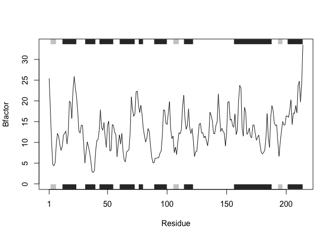

# class06-hw
Tin Nguyen

## Quarto

Quarto enables you to weave together content and executable code into a
finished document. To learn more about Quarto see <https://quarto.org>.

## Running Code

When you click the **Render** button a document will be generated that
includes both content and the output of embedded code. You can embed
code like this:

``` r
# Load the bio3d package for protein structure analysis
library(bio3d)


# Read protein structures from the Protein Data Bank (PDB)
# "4AKE" and "1E4Y" are kinase proteins bound to a drug, "1AKE" is without drug
s1 <- read.pdb("4AKE") # kinase with drug
```

      Note: Accessing on-line PDB file

``` r
s2 <- read.pdb("1AKE") # kinase no drug
```

      Note: Accessing on-line PDB file
       PDB has ALT records, taking A only, rm.alt=TRUE

``` r
s3 <- read.pdb("1E4Y") # kinase with drug
```

      Note: Accessing on-line PDB file

``` r
# Extract only the alpha-carbon (CA) atoms from chain A for each protein
s1.chainA <- trim.pdb(s1, chain="A", elety="CA")
s2.chainA <- trim.pdb(s2, chain="A", elety="CA")
s3.chainA <- trim.pdb(s3, chain="A", elety="CA")

# Extract B-factors from each trimmed structure (measures atomic flexibility)
s1.b <- s1.chainA$atom$b
s2.b <- s2.chainA$atom$b
s3.b <- s3.chainA$atom$b

# Plot B-factor profiles with secondary structure annotations
# B-factors are plotted as line graphs to show flexibility across residues
plotb3(s1.b, sse=s1.chainA, typ="l", ylab="Bfactor") 
```


``` r
plotb3(s2.b, sse=s2.chainA, typ="l", ylab="Bfactor") 
```


``` r
plotb3(s3.b, sse=s3.chainA, typ="l", ylab="Bfactor")
```


``` r
# Load the bio3d package for protein structure analysis
library(bio3d)

# Function to plot B-factors of a specific protein chain
plot_protein_bfactor <- function(pdb_id, chain = "A", atom_type = "CA", plot_type = "l"){
  
  # Read the PDB structure from the Protein Data Bank using its 4-letter ID
  pdb <- read.pdb(pdb_id)
  
  # Trim the structure to only include the specified chain and atom type
  pdb_trimmed <- trim.pdb(pdb, chain=chain, elety=atom_type)
  
  # Extract the B-factor values
  pdb.b <- pdb_trimmed$atom$b
  
  # Plot the B-factors
  plotb3(pdb.b, sse=pdb_trimmed, typ=plot_type, ylab="Bfactor")
}
```

``` r
# Example usage: Plot B-factors for protein 4AKE, chain A
plot_protein_bfactor("4AKE")
```

      Note: Accessing on-line PDB file

    Warning in get.pdb(file, path = tempdir(), verbose = FALSE):
    /var/folders/ct/6y8d1snj4zn_53hz1gdp6wfc0000gn/T//Rtmp3B0tnI/4AKE.pdb exists.
    Skipping download


``` r
# Example usage: Plot B-factors for protein 1AKE, chain A
plot_protein_bfactor("1AKE")
```

      Note: Accessing on-line PDB file

    Warning in get.pdb(file, path = tempdir(), verbose = FALSE):
    /var/folders/ct/6y8d1snj4zn_53hz1gdp6wfc0000gn/T//Rtmp3B0tnI/1AKE.pdb exists.
    Skipping download

       PDB has ALT records, taking A only, rm.alt=TRUE


``` r
# Example usage: Plot B-factors for protein 1E4Y, chain A
plot_protein_bfactor("1E4Y")
```

      Note: Accessing on-line PDB file

    Warning in get.pdb(file, path = tempdir(), verbose = FALSE):
    /var/folders/ct/6y8d1snj4zn_53hz1gdp6wfc0000gn/T//Rtmp3B0tnI/1E4Y.pdb exists.
    Skipping download


