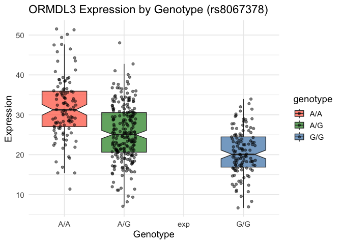

# class12
Tin Nguyen

> Q13

``` r
# Load libraries
library(ggplot2)
library(dplyr)

# Load data
url <- "https://bioboot.github.io/bggn213_W19/class-material/rs8067378_ENSG00000172057.6.txt"
df_raw <- read.table(url, header = FALSE, fill = TRUE, stringsAsFactors = FALSE)
df <- df_raw[, 2:4]
colnames(df) <- c("sample", "genotype", "expression")
df$expression <- as.numeric(df$expression)

# Q13: Sample size and median expression per genotype
cat("Sample size per genotype:\n")
```

    Sample size per genotype:

``` r
print(table(df$genotype))
```


    A/A A/G exp G/G 
    108 233   1 121 

``` r
# Q14: Boxplot in specified format
ggplot(df, aes(x = genotype, y = expression, fill = genotype)) +
  geom_boxplot(notch = TRUE, alpha = 0.7, outlier.shape = NA) +
  geom_jitter(width = 0.2, alpha = 0.5, color = "black") +
  scale_fill_manual(values = c("A/A" = "tomato", "A/G" = "forestgreen", "G/G" = "steelblue")) +
  labs(title = "ORMDL3 Expression by Genotype (rs8067378)",
       x = "Genotype",
       y = "Expression") +
  theme_minimal(base_size = 14)
```

    Warning: Removed 1 row containing non-finite outside the scale range
    (`stat_boxplot()`).

    Warning: Removed 1 row containing missing values or values outside the scale range
    (`geom_point()`).


