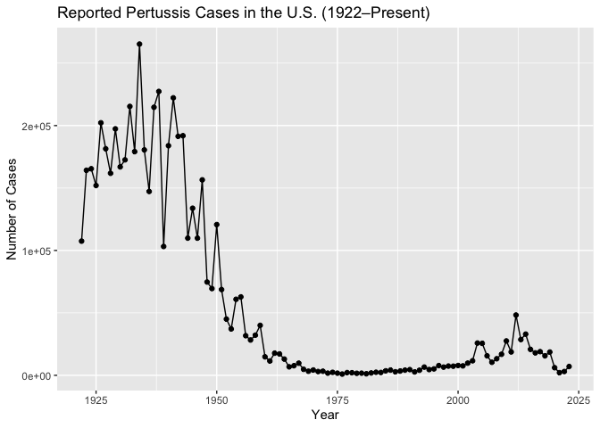
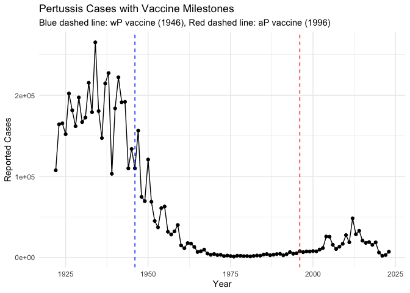
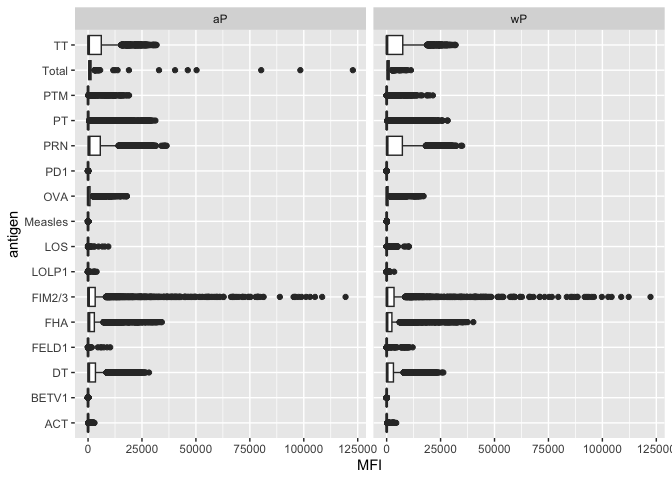

# class18


``` r
cdc <- data.frame(
                          Year = c(1922L,
                                   1923L,1924L,1925L,1926L,1927L,1928L,
                                   1929L,1930L,1931L,1932L,1933L,1934L,1935L,
                                   1936L,1937L,1938L,1939L,1940L,1941L,
                                   1942L,1943L,1944L,1945L,1946L,1947L,1948L,
                                   1949L,1950L,1951L,1952L,1953L,1954L,
                                   1955L,1956L,1957L,1958L,1959L,1960L,
                                   1961L,1962L,1963L,1964L,1965L,1966L,1967L,
                                   1968L,1969L,1970L,1971L,1972L,1973L,
                                   1974L,1975L,1976L,1977L,1978L,1979L,1980L,
                                   1981L,1982L,1983L,1984L,1985L,1986L,
                                   1987L,1988L,1989L,1990L,1991L,1992L,1993L,
                                   1994L,1995L,1996L,1997L,1998L,1999L,
                                   2000L,2001L,2002L,2003L,2004L,2005L,
                                   2006L,2007L,2008L,2009L,2010L,2011L,2012L,
                                   2013L,2014L,2015L,2016L,2017L,2018L,
                                   2019L,2020L,2021L,2022L,2023L),
  No..Reported.Pertussis.Cases = c(107473,
                                   164191,165418,152003,202210,181411,
                                   161799,197371,166914,172559,215343,179135,
                                   265269,180518,147237,214652,227319,103188,
                                   183866,222202,191383,191890,109873,
                                   133792,109860,156517,74715,69479,120718,
                                   68687,45030,37129,60886,62786,31732,28295,
                                   32148,40005,14809,11468,17749,17135,
                                   13005,6799,7717,9718,4810,3285,4249,
                                   3036,3287,1759,2402,1738,1010,2177,2063,
                                   1623,1730,1248,1895,2463,2276,3589,
                                   4195,2823,3450,4157,4570,2719,4083,6586,
                                   4617,5137,7796,6564,7405,7298,7867,
                                   7580,9771,11647,25827,25616,15632,10454,
                                   13278,16858,27550,18719,48277,28639,
                                   32971,20762,17972,18975,15609,18617,6124,
                                   2116,3044,7063)
)
```

### Q1. Pertussis Cases Over Time

``` r
# CDC data should already be named `cdc`
# Clean it if not done yet
names(cdc) <- c("Year", "Cases")
cdc$Cases <- as.numeric(gsub(",", "", cdc$Cases))

# Basic plot
library(ggplot2)

ggplot(cdc) +
  aes(x = Year, y = Cases) +
  geom_point() +
  geom_line() +
  labs(
    title = "Reported Pertussis Cases in the U.S. (1922–Present)",
    x = "Year",
    y = "Number of Cases"
  )
```



``` r
ggplot(cdc) +
  aes(x = Year, y = Cases) +
  geom_point() +
  geom_line() +
  geom_vline(xintercept = 1946, linetype = "dashed", color = "blue") +  # wP
  geom_vline(xintercept = 1996, linetype = "dashed", color = "red") +   # aP
  labs(
    title = "Pertussis Cases with Vaccine Milestones",
    subtitle = "Blue dashed line: wP vaccine (1946), Red dashed line: aP vaccine (1996)",
    x = "Year",
    y = "Reported Cases"
  ) +
  theme_minimal()
```



> Q3.

After the wP vaccine introduction in 1946, pertussis cases dropped
significantly, reaching very low levels by the 1970s. However, following
the switch to the aP vaccine in 1996, cases began to increase again —
suggesting a possible difference in long-term immunity or effectiveness
between the two vaccine types.

## Emter the CMI-PB project

CMI-PB makes all their collected data freely availalabe and they store
it in a database composed different tables. Here we will

We can use the **jsonlite** package to read this data

``` r
library(jsonlite)

subject <- read_json("https://www.cmi-pb.org/api/v5_1/subject", simplifyVector = TRUE)

#head(subject)
```

> Q. How many subjects subjects(i.e. enrolled people\_ are there in this
> data set?

``` r
nrow(subject)
```

    [1] 172

> Q. How many “aP” and “wP” subjects are there?

``` r
table(subject$infancy_vac)
```


    aP wP 
    87 85 

> Q. How many male/female are in the data set

``` r
table(subject$biological_sex)
```


    Female   Male 
       112     60 

> Q. How about gender and race numbers

``` r
#subject$race

table(subject$race, subject$biological_sex)
```

                                               
                                                Female Male
      American Indian/Alaska Native                  0    1
      Asian                                         32   12
      Black or African American                      2    3
      More Than One Race                            15    4
      Native Hawaiian or Other Pacific Islander      1    1
      Unknown or Not Reported                       14    7
      White                                         48   32

> Q. Is this representative of the US population ?

No definitely not. This is data from UCSD population

Let’s read another database table from CMI-PB

``` r
specimen <- read_json("http://cmi-pb.org/api/v5_1/specimen", simplifyVector = TRUE)

ab_data <- read_json("http://cmi-pb.org/api/v5_1/plasma_ab_titer", simplifyVector = TRUE)
```

``` r
#head(specimen)
```

We want to “join” these tables to get all our information together. For
this we will use the **dplyer** package and the `inner_join()` function.

``` r
library(dplyr)
```


    Attaching package: 'dplyr'

    The following objects are masked from 'package:stats':

        filter, lag

    The following objects are masked from 'package:base':

        intersect, setdiff, setequal, union

``` r
meta <- inner_join(subject, specimen)
```

    Joining with `by = join_by(subject_id)`

``` r
#head(meta)
```

One more “join” to get ab_data and meta all together

``` r
abdata <- inner_join( ab_data, meta)
```

    Joining with `by = join_by(specimen_id)`

``` r
#head(abdata)
```

``` r
dim(abdata)
```

    [1] 61956    20

> Q. How many Ab isotype are there in the dataset?

``` r
table(abdata$isotype)
```


      IgE   IgG  IgG1  IgG2  IgG3  IgG4 
     6698  7265 11993 12000 12000 12000 

``` r
length(unique(abdata$isotype))
```

    [1] 6

> Q. How many different antigens are measured in the dataset?

``` r
table(abdata$antigen)
```


        ACT   BETV1      DT   FELD1     FHA  FIM2/3   LOLP1     LOS Measles     OVA 
       1970    1970    6318    1970    6712    6318    1970    1970    1970    6318 
        PD1     PRN      PT     PTM   Total      TT 
       1970    6712    6712    1970     788    6318 

``` r
length(unique(abdata$antigen))
```

    [1] 16

> Q. Make a boxplot of antigen levels across the whole dataset (MFI vs
> antigen)?

``` r
ggplot(abdata) +
  aes(MFI, antigen) +
  geom_boxplot()
```

    Warning: Removed 1 row containing non-finite outside the scale range
    (`stat_boxplot()`).


> Q. Are there obvious differences between aP and wP values ?

``` r
ggplot(abdata) +
  aes(MFI, antigen, col = infancy_vac) +
  geom_boxplot()
```

    Warning: Removed 1 row containing non-finite outside the scale range
    (`stat_boxplot()`).


Or we can “facet by
`infancy_vac' to get two individual plots one for each value of`infancy_vac\`.

``` r
ggplot(abdata) +
  aes(MFI, antigen) +
  geom_boxplot()+
  facet_wrap(~infancy_vac)
```

    Warning: Removed 1 row containing non-finite outside the scale range
    (`stat_boxplot()`).



## Focus on IgG levels

IgG is the most abundant antibody in blood. With four sub-classes (IgG1
to IgG4) crucial for long-term immunity and responding to bacterial &
viral infections.

``` r
igg <- abdata |> 
  filter(isotype == "IgG")

#head(igg)
```

Same boxplot of antigens as before

``` r
ggplot(igg) +
  aes(MFI_normalised, antigen, col = infancy_vac) +
  geom_boxplot() +
  facet_wrap(~visit)
```


Focus in further in just one of htese antigens - let’s pick **PT**
(Pertussis Toxin, one of the main toxins of the bacteria)
**2021_dataset** again for **IgG** antibody isotypes.

``` r
table(igg$dataset)
```


    2020_dataset 2021_dataset 2022_dataset 2023_dataset 
            1182         1617         1456         3010 

``` r
pt_igg <- abdata |> 
  filter(isotype == "IgG", antigen == "PT", dataset=="2021_dataset")
```

``` r
dim (pt_igg)
```

    [1] 231  20

``` r
ggplot(pt_igg) +
  aes(actual_day_relative_to_boost,
      MFI_normalised,
      col= infancy_vac, 
      group = subject_id) +
  geom_point() +
  geom_line() +
  theme_bw() +
  geom_vline(xintercept = 0) +
  geom_vline(xintercept = 14)
```


